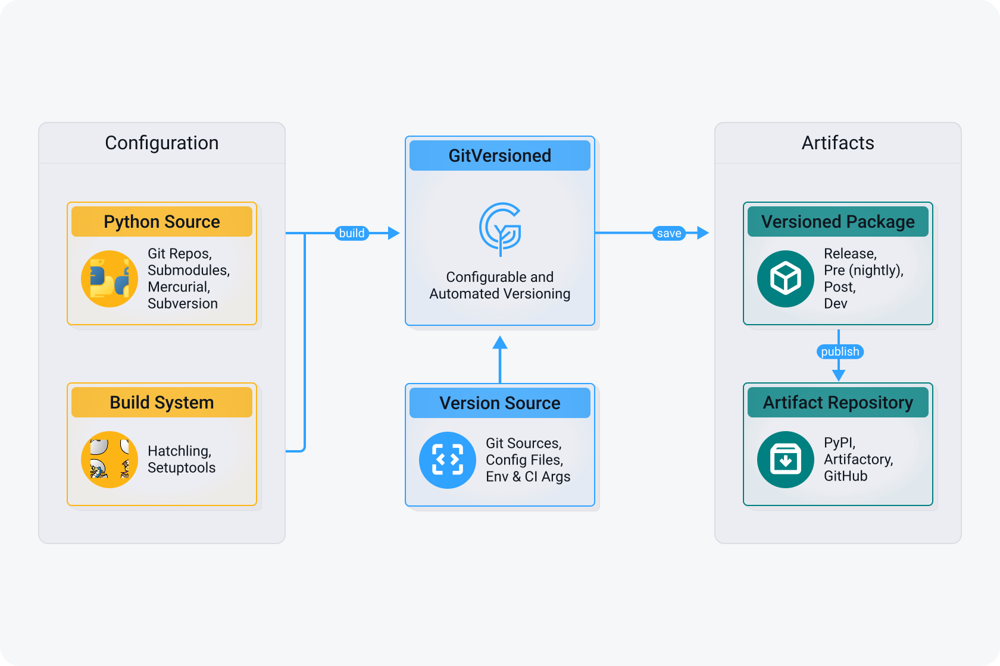

<p align="center">
  <picture>
    <source media="(prefers-color-scheme: dark)" srcset="docs/assets/branding/logo-dark.svg">
    <source media="(prefers-color-scheme: light)" srcset="docs/assets/branding/logo-light.svg">
    
  </picture>
</p>

<p align="center">
  <em>Opinionated PEP 440 Python versioning for Git repos and submodules. Enforces CI/User authority and generates rich version.py files with deep metadata for auditability. Native Hatch & Setuptools support. Simple, predictable, and foolproof automation.</em>
</p>

<p align="center">
  <!-- Package & Release Status -->
  <a href="https://github.com/markurtz/git-versioned/releases">
    
  </a>
  <a href="https://pypi.org/project/gitversioned/">
    
  </a>
  <a href="https://pypi.org/project/gitversioned/">
    
  </a>
  <br/>
  <!-- CI/CD & Build Status -->
  <a href="https://github.com/markurtz/git-versioned/actions/workflows/main.yml">
    
  </a>
  <br/>
  <!-- Issues & Support -->
  <a href="https://github.com/markurtz/git-versioned/issues?q=is%3Aissue+is%3Aopen">
    
  </a>

<a href="https://opensource.org/licenses/Apache-2.0">
    
  </a>
</p>

<p align="center">
  <a href="https://markurtz.github.io/git-versioned">Documentation</a> |
  <a href="https://github.com/markurtz/git-versioned/milestones">Roadmap</a> |
  <a href="https://github.com/markurtz/git-versioned/issues">Issues</a> |
  <a href="https://github.com/markurtz/git-versioned/discussions">Discussions</a>
</p>

______________________________________________________________________

## Overview

<p align="center">
  <picture>
    <source media="(prefers-color-scheme: dark)" srcset="docs/assets/branding/user-flow-dark.svg">
    <source media="(prefers-color-scheme: light)" srcset="docs/assets/branding/user-flow-light.svg">
    
  </picture>
</p>

Welcome to GitVersioned!

GitVersioned is a tool that provides an opinionated, PEP 440-compliant Python versioning strategy for Git repositories and submodules. It enforces CI and user authority over versioning, and generates rich `version.py` files with deep metadata for full auditability.

### Why Use GitVersioned?

- **Auditability:** Deep metadata ensures every build is traceable back to its exact state.
- **Predictability:** Simple, foolproof automation for generating versions.
- **Native Support:** First-class support for modern build systems like Hatch and Setuptools.

## What's New

**Welcome to GitVersioned!**

GitVersioned is currently under active development. Keep an eye on this section for future release highlights and new features once the initial implementation is complete.

## Quick Start

### 1. Build Configuration (Core Workflow)

GitVersioned is primarily used as a build plugin. The preferred pathway is to configure it in your `pyproject.toml`:

```toml
[build-system]
requires = ["hatchling", "gitversioned"]
build-backend = "hatchling.build"

[tool.hatch.version]
source = "gitversioned"
```

*(See the [Installation Guide](https://markurtz.github.io/git-versioned/getting-started/installation/) for Setuptools and `setup.py` alternatives).*

### 2. Installation

To install the standalone CLI for local generation, use `pip` (or `uv`):

```bash
# Standard installation
pip install gitversioned

# Alternative using uv
uv pip install gitversioned
```

For full installation options (from source, Docker, platform-specific notes) and step-by-step onboarding, see the **[Getting Started guide](https://markurtz.github.io/git-versioned/getting-started/)**.

## Core Concepts

This project is built using modern Python tooling, ensuring a stable and typed foundation. It utilizes Ruff and Mypy for code quality.

### Component Architecture

The project is organized into several key areas:

- `docs/`: Project documentation and guides.
- `src/gitversioned`: The core application logic and versioning handlers.
- `tests/`: Automated test suite ensuring correctness and reliability.

## Advanced Usage

Please check the [`examples/`](examples/) directory for advanced examples and configurations.

## General

### Contributing

We welcome contributions! Please see our [Contributing Guide](CONTRIBUTING.md) for more details. For development setup, check out [DEVELOPING.md](DEVELOPING.md).
Please ensure you follow our [Code of Conduct](CODE_OF_CONDUCT.md) in all interactions.

### Support and Security

- For help and general questions, see [SUPPORT.md](SUPPORT.md).
- To report a security vulnerability, please refer to our [Security Policy](SECURITY.md).

### AI & LLM Tooling

This repository includes first-class support for agentic and LLM-assisted development workflows:

- **[AGENTS.md](AGENTS.md):** Repository-specific instructions for AI coding agents (Codex, Copilot Workspace, Gemini, Claude, Cursor, and similar tools). Contains the authoritative guide for project structure, executable commands, code style, and critical constraints.
- **[llms.txt](llms.txt):** A machine-readable index of the project's documentation, following the [llms.txt specification](https://llmstxt.org/). Served at `/llms.txt` on the documentation site to help LLMs quickly locate and consume relevant content.

### License

This project is licensed under the Apache License 2.0. See the [LICENSE](LICENSE) file for details.

### Citations

If you use this software in your research, please cite it using the following BibTeX entry:

```bibtex
@software{gitversioned,
  author = {Mark Kurtz},
  title = {gitversioned},
  year = {2026},
  url = {https://github.com/markurtz/git-versioned}
}
```
